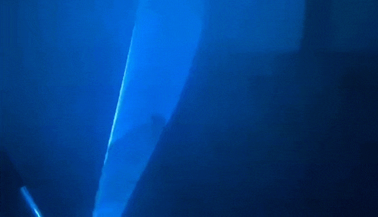

# Kinect2 和 EtherDream 交互教程

这是一个人和激光互动的案例，实现的效果非常的简单：当一定区域检测到物体的时候，激光会从一个圆形变成一个矩形。



## 大概思路

首先使用 [Processing](https://processing.org/) 程序控制 [Kinect2](https://developer.microsoft.com/zh-cn/windows/kinect/)，Kinect2 对人体进行检测。当 Kinect2 检测结果出来以后，建立一个客户端向服务器发送检测的结果。用 [Nodejs](https://nodejs.org/zh-cn/) 搭建一个服务器，接受客户端传来的检测结果，根据结果通过 [EtherDream](https://ether-dream.com/) 去控制激光的形状。

## 开发

这是基于 MacOS 的开发教程，Windows 没有 openkinect 库。

### 软件准备

- 安装 Processing
  - 安装 openkiect 库
  - 安装 controlP5 库
- 安装 Nodejs
- 安装 Yarn

### 硬件准备

将 Kinect2 和 EtherDream 都和电脑相连接，同时 EtherDream 也和激光相连。

### 运行

- 将代码克隆或者下载到本地：`git clone https://github.com/pearmini/kinect2-etherdream-demo.git`
- 进入 server 文件夹并且安装依赖：`cd kinect2-etherdream-demo/server && yarn install`
- 开启服务器 `yarn run dev` 或者 `yarn run build && node dist/index.js`
- 用 Processing 打开 `clinet/clinet.pde`，并且在屏幕上画一个矩形，设置最大和最小深度，从而确定检测的范围。

## 介绍

Kinect2 可以获得深度数据，这样我们就可以通过某个区域的深度判断该区域一定距离内有没有物体，下面是关键代码。

```java
Boolean hasObject(int x, int y, int w, int h, int minDepth, int maxDepth) {
  int[] depth = k2.getRawDepth(); // 深度数据
  int x1 = min(k2.depthWidth, x + w);
  int y1 = min(k2.depthHeight, y + h);

  for (int i = x; i < x1; i++) {
    for (int j = y; j < y1; j++) {
      int index = k2.depthWidth - i - 1 + j * k2.depthWidth;
      int rawDepth = depth[index];
      if (rawDepth > minDepth && rawDepth < maxDepth) {
        return true;
      }
    }
  }

  return false;
}
```

Kinect2 建立一个客户端向服务器发送数据，关键代码如下。

```java
void drawRect() {
  Boolean isIn = hasObject(rectX, rectY, rectWidth, rectWidth, MIN, MAX);
  color c = isIn ? color(0, 255, 0) : color(255, 0, 0);
  if (client.active()) {
    char flag = isIn ? 'i' : 'o';
    client.write(frameCount + "-" + flag);
  }
  stroke(c);
  noFill();
  rect(rectX, rectY, rectWidth, rectHeight);
}
```

Nodejs 开启服务器获得从 Kinect2 获得的检测结果。

```js
export default function () {
  const net = require("net");
  const port = 8000;
  const hostname = "127.0.0.1";

  const server = new net.createServer((connection) => {
    connection.on("data", function (data) {
      const result = data.toString();
      const chars = result.split("-");
      runtime.flag = chars[1] === "i" ? true : false;
      console.log(result, runtime.flag)
    });

    connection.on("end", function () {
      console.log("close connection");
    });
  });

  server.listen(port, hostname, function () {
    console.log(`The server is running on：http://${hostname}:${port}`);
  });
}
```

Nodejs 根据检测结果通过 EtherDream 控制激光，基于 Nodejs 控制激光的方法请参考这个[仓库](https://github.com/ofcourseio/laser-dac-tutorials)。

```js
import { DAC } from "@laser-dac/core";
import { Simulator } from "@laser-dac/simulator";
import { EtherDream } from "@laser-dac/ether-dream";
import { Scene, Rect, Line, Circle } from "@laser-dac/draw";
import runtime from "./global";

export default async function () {
  const dac = new DAC();
  dac.use(new EtherDream());
  await dac.start();

  const scene = new Scene({
    resolution: 500,
  });
  scene.start(step);
  dac.stream(scene);

  function step() {
    const boxWidth = 0.6;
    const boxHeight = 0.2;
    const boxX = (1 - boxWidth) / 2;
    const boxY = (1 - boxHeight) / 2;

    if (runtime.flag) {
      drawRect();
    } else {
      drawCirlce();
    }

    function drawRect() {
      const rect = new Rect({
        width: boxWidth,
        height: boxHeight,
        color: [0, 1, 1],
        x: boxX,
        y: boxY,
      });
      scene.add(rect);
    }

    function drawCirlce() {
      const radius = 0.2;
      const circle = new Circle({
        x: 0.4,
        y: 0.4,
        radius,
        color: [0, 1, 1],
      });
      scene.add(circle);
    }
  }
}
```
